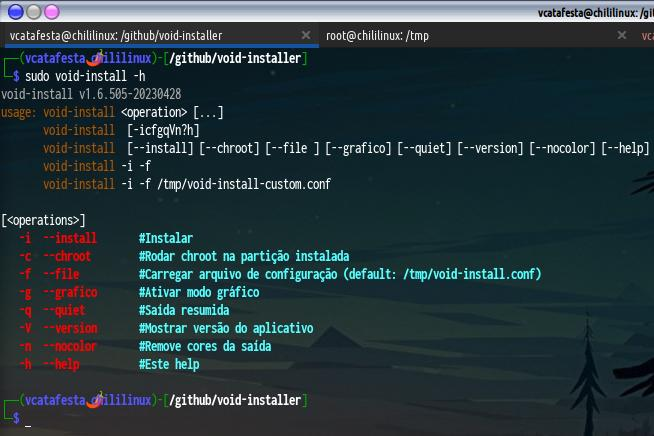
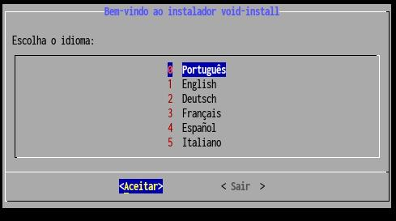
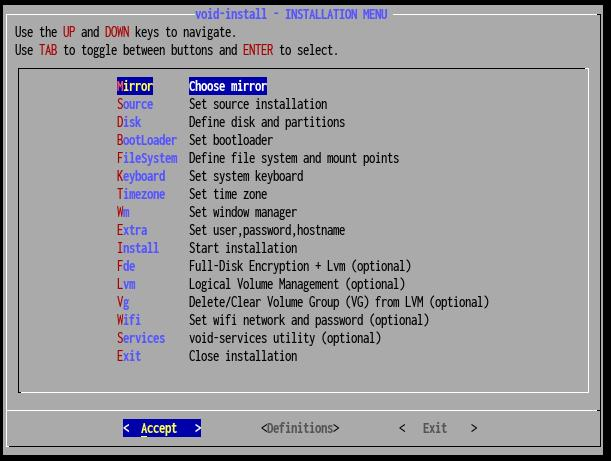

# void-install - instalador brasileirinho do VOID Linux

## Download:

- 1 - usando git
	- git clone --depth=1 https://github.com/voidlinux-br/void-installer

- 2 - usando curl/wget stdin
	- sh <(curl -s -L https://raw.githubusercontent.com/voidlinux-br/void-installer/master/install.sh)
	- sh <(wget -q -O - https://raw.githubusercontent.com/voidlinux-br/void-installer/master/install.sh)
	- curl -s -O https://raw.githubusercontent.com/voidlinux-br/void-installer/master/install.sh | sh
	- wget -q -O - https://raw.githubusercontent.com/voidlinux-br/void-installer/master/install.sh | sh

- 3 - usando curl/wget
	- curl -O https://raw.githubusercontent.com/voidlinux-br/void-installer/master/install.sh
	- wget https://raw.githubusercontent.com/voidlinux-br/void-installer/master/install.sh
	- chmod +x install.sh
	- ./install.sh

## Instalação (após download):
- 1 - usando make
	- sudo make install

- 2 - rodando no repo local
	- ./void-install

Examples
--------

Run `void-install` without any arguments to get help.

**Note:** `sudo` or escalated privileges are required to actually run the installer.

Run `void-install -i` to start the installer and choose language.

